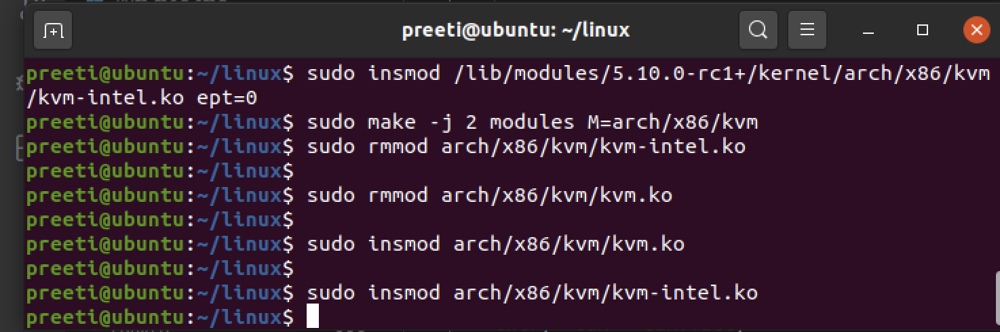

# Assignment3 Instrumentation via hypercall:

# Q1. For each member in your team, provide 1 paragraph detailing what parts of the lab that member implemented / researched.

Team Members:

Preeti Parihar- (id:015218073)

*Setup the environment in Mac using VMware Fusion 12.x Pro(Student Licence) and download the ISO disk image file for Ubuntu Desktop(Ubuntu 20.04.1 LTS). Created VM successfully in first attempt by allocating 200GB storage and 6GB RAM and 2 Processors.

*Once successfully reboot I checked version with uname -a and output is 5.10 then using virt manager I setup inner VM using Ubuntu iso file.

*Researched and Discussed about exits and interrupts using SDM as a reference and help each other writing and executing the code.

*Contribution: code for return the exit for each input value provided  path: linux/arch/x86/kvm -> cupid.c and linux/arch/x86/kvm/vmx -> vmx.c

Priyanka Devendran- (id:015231411)

*Setup the environment in Mac using VMware Fusion and installed Ubuntu and then created inner vm.

*Discussed and Researched about about exits and interrupts using SDM as a reference.

*Contribution: code for test program that exercises the functionality in our hypervisor modification and help executing vmx.c

#   Q2.Describe in detail the steps you used to complete the assignment. Consider your reader to be someone skilled in software development but otherwise               unfamiliar with the assignment. Good answers to this question will be recipes that someone can follow to reproduce your development steps.

Prerequisites:

To modify the CPUID emulation code in KVM to report back additional information when special CPUID leaf nodes are requested.
* For CPUID leaf node %eax=0x4FFFFFFE:
    * Return the number of exits for the exit number provided (on input) in %ecx
    * This value should be returned in %eax

Requirement:

Assignment is to modify the CPUID emulation code in KVM to report back additional information when a special CPUID “leaf function” is called.
* For CPUID leaf function %eax=0x4FFFFFFE:
* Return the exit if defined in SDM and KVM for each input in %eax
* If values not found in SDM return 0 in all %eax, %ebx, %ecx registers and return 0xFFFFFFFF in %edx.
* If exits not enabled in KVM return 0 in all %eax, %ebx, %ecx,%edx registers.

# SETUP the Environment as per the assignment2:

1.	We installed VMware fusion 12.x Pro in Macbook then Downloaded the ISO disk image for Ubuntu Desktop(Ubuntu 20.04.1 LTS).

2.	Created Virtual Machine by allocating 200GB storage and 4GB RAM.

3.	Clone the Git repository for the latest linux kernel source code :
    
    git clone https://github.com/torvalds/linux.git

4.	Building The Kernel:

    To build the kernel (once you have cloned the Linux git repository), the following sequence of commands can be used (eg, for Ubuntu – other distributions have     similar steps but may differ in the installation of the build prerequisites):

1.  sudo bash

2.	apt-get install build-essential kernel-package fakeroot libncurses5-dev libssl-dev ccache bison flex libelf-dev

3.	uname -a (and note down your kernel version, for example “5.4.0-52-generic”)

4.	cp /boot/config-4.15.0-112-generic ./.config (substitute your version obtained from the previous step here though)

5.	make oldconfig (and then just use the default for everything, don’t change anything – you can do this by holding down enter)

6.	make && make modules && make install && make modules-install (will take a long time the first time)

7.	reboot

Note: When I reboot I got following error: Gave up waiting for root device. ALERT: UUID=******* does not exits. Dropping to a shell, BusyBox.

Steps I use to solve above error:

1.	reboot -f (one window will open in front of you with 3 options choose advance option and now you have 5 to 6 ubuntu versionselect the ubuntu version same was     before the reboot in my case it was 5.4.0-52-genericpress enteropen the terminalgo to linux source folder and execute below mentioned command in sequence       and then reboot again )

2.	sudo bash

3.	nproc(To know the number of processing units, in my case it was 2 core, specify the number of cores in -j option in the below command)

4.	sudo make -j 2 && sudo make modules_install -j 2 && sudo make install -j 2

5.	update-grub(no space between update and grub)

6.	make

7.	reboot

8.	Verify that you are using the newer kernel (5.8, etc) after reboot:

    uname -a (In my case version after reboot is 5.10.0-rc1)

# Implement Assignment Functionalities for assignment3:

1.	We edited cpuid.c and vmx.c for implementing code for calculating the number of  exit for each input by referring to SDM for each exit.
    
    There are 69 exit reason defined in the SDM, with few skipped. The skipped ones are like 4,5,6 are returned with value 0 in all %eax, %ebx, %ecx registers and as 0xFFFFFFFF in %edx.
    
    If exits not enabled in KVM then we will return 0 in all %eax, %ebx, %ecx,%edx registers.
    

    We modified function kvm_emulate_cpuid in the following file:
    linux/arch/x86/kvm/cupid.c, and the different exit handler functions in the following file: linux/arch/x86/kvm/vmx/vmx.c

2.	Build the updated code: After changing the code in KVM for the assignment requirement, you can rebuild using the same “make” sequence commands or simply use       below command.

    sudo make -j 2 modules M=arch/x86/kvm (*This will show you any error if you have and this way you can check fast, instead of 2 write your nproc output if no        error than follow next step to load and unload)
    
3.	Load and unload the kvm kernel module (kvm.ko) and kvm-intel module (kvm-intel.ko) using the following commands:

    sudo rmmod arch/x86/kvm/kvm-intel.ko
    
    sudo rmmod arch/x86/kvm/kvm.ko
    
    sudo insmod arch/x86/kvm/kvm.ko
    
    sudo insmod arch/x86/kvm/kvm-intel.ko
    
# To test changes we need to create a VM using virt manager:

1.	Use the following command to install KVM, supporting packages and virt manager.

    sudo apt-get update

    sudo apt install qemu-kvm libvirt-daemon-system libvirt-clients bridge-utils virt-manager (*There are different commands available over internet but this           is simple and single line command to install kvm and virt-manager)

2.	Verify KVM Installation using the following command. You should see an empty list of virtual machines. This indicates that everything is working correctly.

    virsh -c qemu:///system list

3.	Now open virtual machine manager and using Ubuntu ISO file create inner vm:

4.	Open terminal and install cpuid using below command:

    sudo apt-get update

    sudo apt-get install cpuid

5.	Create test program name as Test_Assignment3.c file inside inner vm to test changes of cupid.c and vmx.c 

6.	Compile this Test_Assignment3.cfile using gcc and make it executable:

    gcc Test_Assignment3.c-o test

7.	Now run this test3 executable file to check the output as following on terminal:

    ./test  
    
    
Please find the screenshot below of the input and its corresponding exit:

#   Q3. Comment on the frequency of exits – does the number of exits increase at a stable rate? Or are there more exits performed during certain VM operations? Approximately how many exits does a full VM boot entail?
-->We could see that the number exits increase at in an  unstable rate.We could see input such as 1-external interrupts, 30- I/O instructions the number of exits are higher as compared to others.

#   Q4.Of the exit types defined in the SDM, which are the most frequent? Least?

From running the test script the most frequent exit type observed in the inner VM was 48-EPT Viloation instruction exit at around 333068 exits, and we could see many exit that were 0, such as 2-triple fault, 8-NMI Window, 9-task switch, 44-APIC access, 45-Virtualized EOI, 67-UMWait, 68-TPause, etc.

___________________________________________________________________________________________________________________________________________________________

# Assignment4 Nested paging Vs Shadow Paging:

Team Members:

Preeti Parihar- (id:015218073)
Did the set up the internal VM workings for this assignment. Had performed the exit counts for ept=0 execution of the vm in our machine. And documented the outputs and the difference between ept=0 and ept=1

Priyanka Devendran- (id:015231411)
Set up the shell script to obtain the output we required. Then performed the exit counts for ept=1 execution of the vm in our machine. And documented the output for the same.

Settings:
*Run assignment 3 code and boot a test VM using that code.

*Once the VM has booted, record total exit count information (total count for each type of exit handled by KVM). 

*Shutdown inner VM.

*list the moduels in outer VM as shown below:

*we first accessed and removed the kvm-intel.ko module, in our modified kernel version, 5.10.0-rc1+, which has the exit settings for our machine.

*insert the kvm-intel.ko module, changing the ept setting to 0.

Below was the command used

-->sudo rmmod /lib/modules/5.10.0-rc1+/kernel/arch/x86/kvm/kvm- intel.ko
-->sudo insmod /lib/modules/5.10.0-rc1+/kernel/arch/x86/kvm/kvm- intel.ko ept=0

*Once the above steps are done we open the inner VM to check the output.

*Inside the inner vm we run the same shell script file, now for ept=0.

*The output of the shell script files is as followsRemove the ‘kvm-intel’ module from your running kernel:

Below are the screenshot after changing it to 0:

## Test Output - ept=0:

# Following are the observations:
1. The total number of exits for when the ept setting was set to 0 is higher than
when ept setting was set to default value of 1.

2.When nested paging is enabled by changing ept=1, the VM has less exits.When ept=0
   with shadow paing it produces more number of exits.
   
3. The exit counts were nearly doubled for each exit counts when ept=0 than when ept=1

4.Few inputs with exit observed as provided in screenshot above:

   For exit 32-WRMSR
       i. For ept=1, nested paging enabled, total exits for exit 32 is 35722
       ii. For ept=0, nested paging disabled, and shadow paging enabled, total exit for exit 32 is 52530
       
   For exit 1-External Interrupt
      i. For ept=1, number of exits for exit 1 is 42541
      ii. For ept=0, number of exits for exit 28 is 52725 

# Difference observed:

In nested paging mode, ept=1, the speed of the VM was greater, whereas In Shodow paging mode, ept=0 the sped of the VM is slower.Also more exits were observed in nested paging as compared to shaodow paging.This is beacuse when shadow paging is enabled, page translation happens, this causes more exit in the VM.
